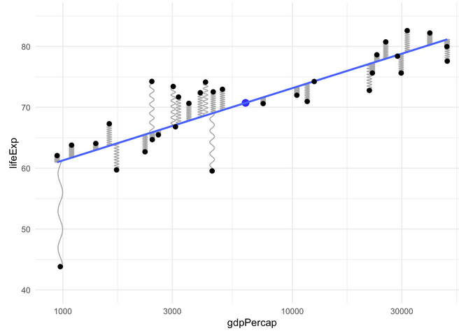
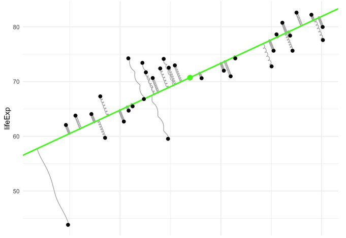

# ggsprings

<!-- badges: start -->
[](https://lifecycle.r-lib.org/articles/stages.html#experimental)
<!-- badges: end -->

ggsprings is designed to
implement an extension of `geom_path` which draws paths as springs instead of straight lines.
Aside from possible artistic use, the main impetus for this is to draw points connected by springs,
with properties of length and tension. 

A leading example is to illustrate how least squares regression
is "solved" by connecting data points to a rod, where the springs are constrained to be vertical.
The mathematics behind this are well-described in this [Math Stackexchange post](https://math.stackexchange.com/questions/2369673/proving-linear-regression-by-using-physical-springs-model),
where the least squares estimates of intercept and slope are shown to be the equilibrium position that minimized the sum of forces
and torques exerted by springs.


If the springs are allowed to be free, the physical solution is the major PCA axis.


How to do this is described in the `ggplot2` book, https://ggplot2-book.org/ext-springs.
The current (non-working) version here was copied/pasted from the book.

A blog post by Joshua Loftus, [Least squares by springs](https://joshualoftus.com/posts/2020-11-23-least-squares-as-springs/least-squares-as-springs.html)
illustrates this, citing [code from Thomas Lin Pederson](https://twitter.com/thomasp85/status/1331338379636649986).

### Examples

These images show the intent of a `ggsprings` package.

**Least squares regression**



**Principal components analysis**



**Animated version**

This [StatsExchange post](https://stats.stackexchange.com/questions/2691/making-sense-of-principal-component-analysis-eigenvectors-eigenvalues/140579#140579)
show an animation of the process of fitting PCA by springs.


## Installation

You can install the development version of ggsprings by forking this repo and trying to get it going.


## Example

There is really nothing working here yet:

``` r
library(ggsprings)
## basic example code
```

## Related 

* An [interactive demo](https://www.desmos.com/calculator/90vaqtqpx6) by Trey Goesh allows you to 
visualize the effect of moving points, changing spring parameters, etc.
